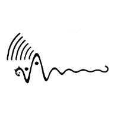

# EnHom's Blog 
Powered by Chirpy which is a Jekyll theme for github pages.

 

## Usage

Check out the [theme's docs](https://github.com/cotes2020/jekyll-theme-chirpy/wiki).

Note that Jekyll can only read files in the folders
`_data`, `_layouts`, `_includes`, `_sass` and `assets`, as well as a small part of options of the `_config.yml` file
from the theme's gem. 

## Contributing

This repository is automatically updated with new releases from the theme repository. If you encounter any issues or want to contribute to its improvement, please visit the [theme repository][chirpy] to provide feedback.

## License

This work is published under [MIT][mit] License.

[gem]: https://rubygems.org/gems/jekyll-theme-chirpy
[chirpy]: https://github.com/cotes2020/jekyll-theme-chirpy/
[CD]: https://en.wikipedia.org/wiki/Continuous_deployment
[mit]: https://github.com/cotes2020/chirpy-starter/blob/master/LICENSE
